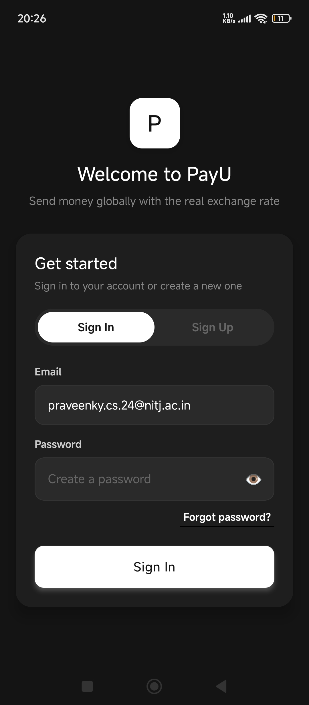
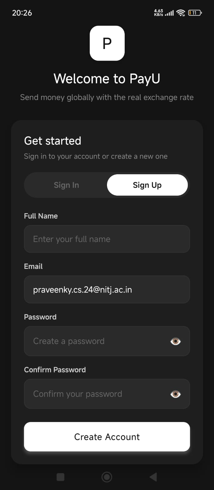
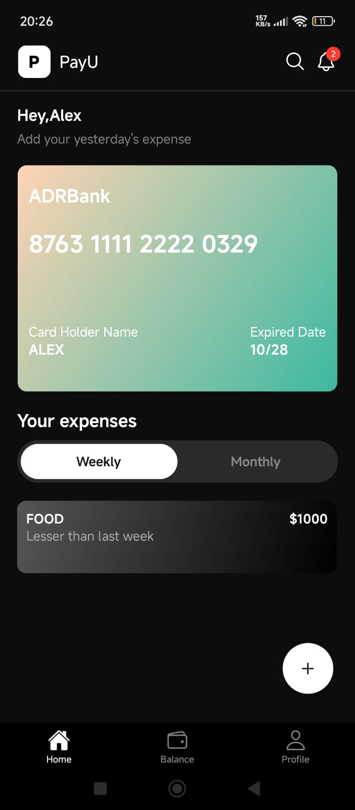
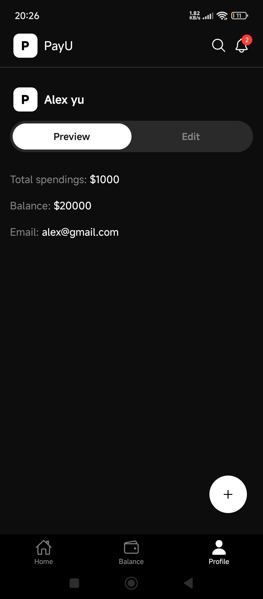

# 📊 Finance Tracker App

Hey 👋
This is my **Finance Tracker App** built using **React Native (Expo)**.
The goal of this app is simple — help users track their expenses in a clean and easy way.

---

## 🚀 What this app does

* 💳 Shows a beautiful card UI
* 📊 Lets you track expenses (Weekly & Monthly)
* 🔄 Switch between views easily
* 🔔 Notification icon with badge
* 📱 Works smoothly on mobile devices

---

## 📂 Project Structure

```
tuf/
 └── finance-tr/
      ├── app/
      ├── assets/
      │    └── images/
      │         ├── loginu.jpeg
      │         ├── register.jpeg
      │         ├── home.jpeg
      │         ├── balance.jpg
      │         └── profile.jpeg
      ├── components/
      ├── package.json
      └── README.md
```

---

## 🛠 Tech Used

* React Native (Expo)
* JavaScript
* Expo Linear Gradient
* Expo Vector Icons

---

## ⚙️ How to Run the App

### 1. Clone the repo

```bash
git clone <your-repo-link>
```

---

### 2. Go inside the project

```bash
cd finance-tr
```

---

### 3. Install all dependencies

```bash
npm install
```

---

### 4. Start the app

```bash
npm start
```

---

## 📱 Run on Your Phone

1. Install **Expo Go** app
2. Run `npm start`
3. Scan the QR code
4. App will open on your phone 🎉

---

## 📸 App Screenshots

### 🔐 Login Screen

<p align="center">
  
</p>

---

### 📝 Register Screen

<p align="center">
  
</p>

---

### 🏠 Home Screen

<p align="center">
  
</p>

---

### 💰 Balance Screen

<p align="center">
  
</p>

---

### 👤 Profile Screen

<p align="center">
  
</p>

---

## ⚠️ Common Problems

* Image not showing → check file name carefully
* Path should be correct (`assets/images/...`)
* Don’t forget to push images to GitHub

---

## 📌 Notes

* Always run commands inside **finance-tr folder**
* Internet is needed for Expo
* If QR doesn’t work → try emulator

---

## 👨‍💻 Author

**Praveen Yadav**

---

## ⭐ If you like this project

Give it a ⭐ on GitHub — it really helps!

---
